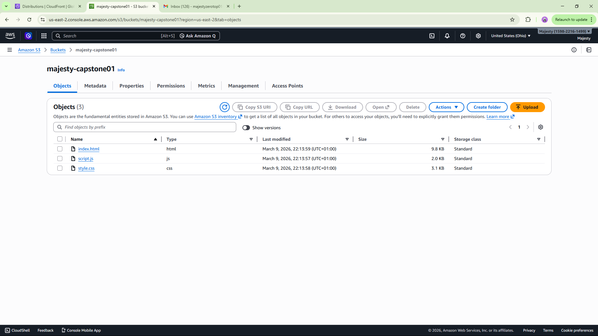
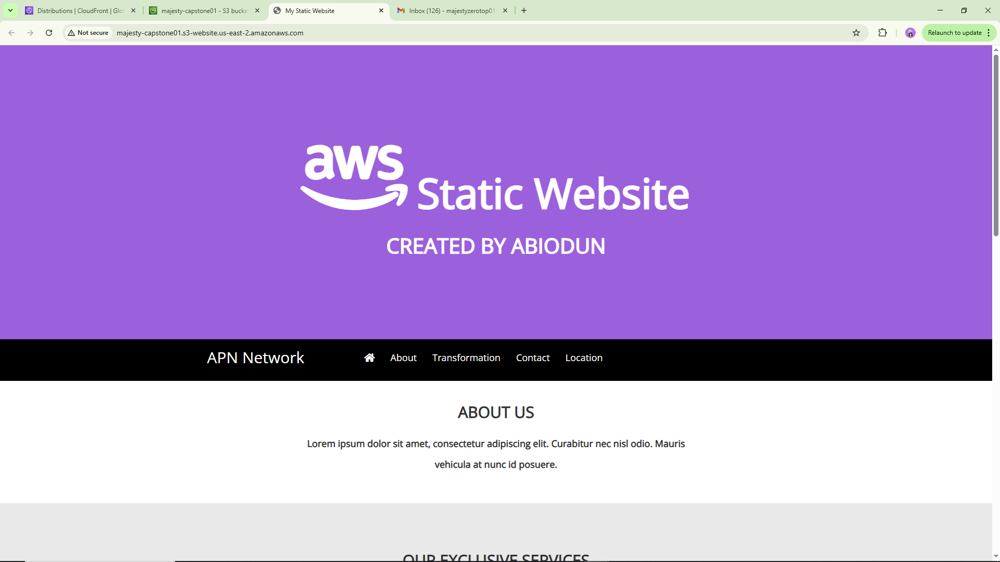
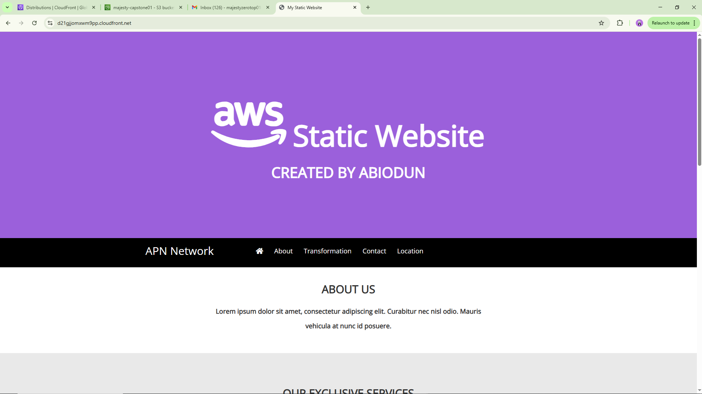

# Capstone Project 1

## Deploying a Static Web Application using Amazon S3 and CloudFront

---

## Project Overview

This project demonstrates how to deploy a **static web application** using **Amazon Web Services (AWS)**.

The website files are stored in **Amazon S3**, configured for **static website hosting**, and distributed globally using **Amazon CloudFront** to improve performance, scalability, and availability.

This architecture is commonly used in modern cloud environments to host static websites such as landing pages, documentation sites, and frontend applications.

---

## Technologies Used

* Amazon S3 (Static Website Hosting)
* Amazon CloudFront (Content Delivery Network)
* Git
* GitHub

---

## Architecture Diagram

User Request Flow:

User Browser
↓
CloudFront CDN
↓
Amazon S3 Static Website Bucket
↓
HTML / CSS / JavaScript Files

CloudFront caches the website content at edge locations around the world to reduce latency and improve load times.

---

## Project Implementation Steps

### Step 1 — Create an S3 Bucket

A new Amazon S3 bucket was created with a globally unique name.

Public access was configured to allow objects to be accessed through the S3 website endpoint.

---

### Step 2 — Configure Bucket Policy

The bucket policy was updated to allow **GetObject** permissions so users can access the files publicly.

Example permission applied:

```
s3:GetObject
```

This allows public read access to website files.

---

### Step 3 — Upload Static Website Files

The static website files were uploaded to the S3 bucket.

Important note:
The contents of the folder were uploaded, not the folder itself.

Files uploaded include:

* index.html
* CSS files
* JavaScript files
* images and assets

---

### Step 4 — Enable Static Website Hosting

Static website hosting was enabled in the bucket properties.

Configuration used:

Index document

```
index.html
```

After enabling, AWS generated a **website endpoint URL**.

---

### Step 5 — Test the S3 Website Endpoint

The generated S3 website URL was opened in a browser to verify the website loads successfully.

---

### Step 6 — Create a CloudFront Distribution

A CloudFront distribution was created using the **S3 website endpoint as the origin**.

CloudFront acts as a Content Delivery Network (CDN) that:

* caches static assets
* reduces latency
* improves performance globally

---

### Step 7 — Verify CloudFront Deployment

The CloudFront distribution domain name was used to access the website.

The website loaded successfully through the CloudFront CDN.

---

## Screenshots

### Files Successfully Uploaded to S3



---

### Static Website Hosted on S3



---

### Website Delivered Through CloudFront



---

## Clean Up

To avoid unnecessary AWS charges, the following resources were deleted after testing:

* CloudFront Distribution
* S3 Bucket
* Uploaded Objects

---

## Key Learning Outcomes

Through this project, the following concepts were learned:

* Static website hosting using Amazon S3
* Configuring S3 bucket policies
* Using CloudFront as a CDN
* Deploying production-ready static websites
* Managing AWS cloud resources

---

## Author

Majesty
